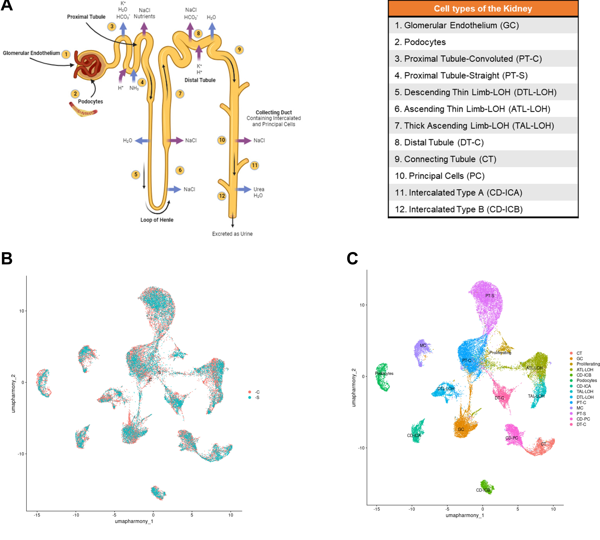

# Rat Kidney snRNA-seq Reference



> A reusable reference for annotating rat kidney single-cell and single-nucleus RNA-seq datasets.

This repository provides a reusable single-nucleus RNA-seq reference of the 4-week rat kidney from the HSRA rat model which was derived from the NIH Heterogeneous Stock (HS).

The resource is designed to support cell type annotation of rat kidney single-cell and single-nucleus datasets using SingleR (Bioconductor) and Seurat label transfer. It includes annotated reference objects and example workflows.

---

## Overview

Single-cell and single-nucleus RNA-seq studies of the kidney require reliable reference datasets for accurate cell type annotation. While several resources exist for human and mouse, fewer are available for rat.

This dataset provides a curated reference of the juvenile rat kidney with annotated cell types and supporting marker genes. It is intended for use in annotation, cross-dataset comparison, and validation of kidney cell type markers. Although generated from 4-week tissue, this reference may be applicable to both juvenile and adult rat kidney datasets.

---

## Data

Reference objects needed for annotation are available on Zenodo:

https://doi.org/10.5281/zenodo.19196716

Files:
- hsra_kidney_reference_dietseurat.rds
- hsra_kidney_reference_sce_aggr.rds

---

## Cell Type Annotation  

Annotations were assigned based on clustering, differential expression, and known kidney marker genes.

### There are 14 celltypes included in the reference:

Podocytes,
GC - Glomerular endothelial cells,
PT-C - Proximal tubule-convoluted,
PT-S - Proximal tubule-straight,
DTL-LOH - Descending thin limb,
ATL-LOH - Ascending thin limb,
TAL-LOH - Thick ascending limb,
DT-C - Distal tubule-convoluted, 
CT - Connecting tubule,
CD-PC - Collecting duct-Principal Cell,
CD-ICA - Collecting duct-Intercalated type A,
CD-ICB - Collecting duct-Intercalated type B,
MC - Mesenchymal-derived (Mesangial, Fibroblasts, etc),
Proliferating

---

## Quick Start

### SingleR annotation

```r
library(SingleR)

#Load your query dataset (must be SingleCellExperiment)
#query_sce <- readRDS("your_query_sce.rds")

#Download reference from Zenodo 
ref <- readRDS("path/to/hsra_kidney_reference_sce_agg.rds")

pred <- SingleR(
  test = query_sce,
  ref = ref,
  labels = ref$celltype
)

table(pred$labels)
```

### Seurat label transfer

```r
library(Seurat)
#Load your query dataset (Seurat object)
#query_obj <- readRDS("your_query_seurat.rds")

#Download reference from Zenodo
ref <- readRDS("path/to/hsra_kidney_reference_dietseurat.rds")

anchors <- FindTransferAnchors(
  reference = ref,
  query = query_obj,
  dims = 1:30
)

predictions <- TransferData(
  anchorset = anchors,
  refdata = ref$celltype,
  dims = 1:30
)

query_obj <- AddMetaData(query_obj, metadata = predictions)
```

---

## Methods Summary

Single-nucleus RNA-seq data were processed using Seurat. Cells were filtered using standard quality control metrics, normalized, and clustered. Cell type annotations were assigned based on differential gene expression and established kidney marker genes.

Reference objects were generated for use with SingleR and Seurat label transfer workflows. This reference was validated across independent rat kidney datasets using both SingleR annotation and Seurat label transfer approaches.

---

## Repository Structure

```
hsra-rat-kidney-reference/
├── scripts/
│   ├── run_singler_example.R
│   └── run_seurat_label_transfer.R
└── README.md
```

---

## Associated Publication

https://doi.org/10.1152/ajprenal.00258.2024

---

## Citation

If you use this reference in your work, please cite:

Milner AR, Johnson AC, Attipoe EA, Wu W, Challagundla L, Garrett MR. Methylseq, single-nuclei RNAseq, and discovery proteomics identify pathways associated with nephron-deficit CKD in the HSRA rat model. American Journal of Physiology-Renal Physiology 2025 328:4, F470-F488

### BibTeX

```bibtex
@article{doi:10.1152/ajprenal.00258.2024,
author = {Milner, Andrew R. and Johnson, Ashley C. and Attipoe, Esinam M. and Wu, Wenjie and Challagundla, Lavanya and Garrett, Michael R.},
title = {Methylseq, single-nuclei RNAseq, and discovery proteomics identify pathways associated with nephron-deficit CKD in the HSRA rat model},
journal = {American Journal of Physiology-Renal Physiology},
volume = {328},
number = {4},
pages = {F470-F488},
year = {2025},
doi = {10.1152/ajprenal.00258.2024},
    note ={PMID: 39982494}
```

---

## Limitations

This reference is derived from 4-week rat kidney tissue in the HSRA model and littermate controls. While it captures major kidney cell types, users should consider differences related to developmental stage, disease context, and species when applying this reference.


